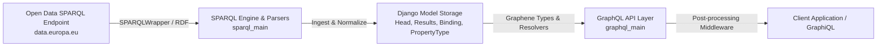

# Master's Thesis

**Thema:** "Processing of mapping an existing SparQL Open Data endpoint to GraphQL endpoint without losing data integrity"

---

## Motivation

The rigid structure of SPARQL queries and the steep learning curve required to comprehend semantic web data schemas (RDF, ontologies, namespaces) make it challenging for frontend developers and application end-users to utilize open data effectively. Moreover, smaller organizations often lack the budget or technical resources to invest in specialized semantic technology training. RDF query composition can significantly slow down project timelines. 

Independent researchers and students attempting to build applications using open data portals (such as [data.europa.eu](https://data.europa.eu/)) often face steep barriers when integrating semantic data. 

This project bridges that gap by providing a middleware and translation layer that extracts, normalizes, and maps SPARQL open data endpoints to an intuitive **GraphQL API** without losing underlying RDF data integrity, language tags (`xml:lang`), data types, or metadata.


---

## Frontend Design


---

## Features

- **Automated SPARQL to GraphQL Transformation:** Queries external SPARQL endpoints (e.g. data.europa.eu DCAT-AP catalogs) and exposes the results through a structured GraphQL schema.
- **Data Integrity & RDF Semantics Preservation:** Retains RDF literal metadata such as `xml:lang`, `datatype`, and RDF `type` alongside values.
- **Flexible Filtering & Sorting:** Resolver-level filtering by language (`xml_lang`) or property type (`type`), plus custom sorting options (`order_by`).
- **Grouped & Aggregated Views:** Built-in grouping queries to aggregate bindings by language (`grouped_bindings`) or maintainer contact (`grouped_maintainer_email`).
- **Spatial / Geometry Extraction:** Parses embedded GeoJSON geometries (`locn:geometry`) from open datasets.
- **Custom Response Middleware Pipeline:**
  - `RemoveGraphQLDataMiddleware`: Simplifies payload consumption.
  - `CleanNullAndEmptyObjectsMiddleware`: Recursively removes empty dictionaries, empty lists, and null fields from GraphQL responses.
  - `ReplaceXmlLangMiddleware`: Replaces sanitized field names back to standard `xml:lang` notation in JSON payloads.
- **REST Endpoints for Discovery:** Helper endpoints to fetch available graph IRIs and query European data portal catalogs (e.g., Stadtverwaltung Chemnitz datasets).

---

## Architecture & Data Flow



---

## Tech Stack

- **Backend Framework:** Django 4.2+
- **GraphQL Engine:** Graphene-Django (`graphene_django`)
- **Semantic Web & RDF:** `SPARQLWrapper`, `rdflib`, `pymantic`
- **Database:** SQLite (default)
- **CORS Support:** `django-cors-headers`

---

## Endpoints

### 1. GraphQL Endpoint
- **URL:** `POST /graphql/` or `GET /graphql/` (GraphiQL interactive UI enabled)
- **Features:** Allows dynamic querying of dataset bindings, headers, maintainers, and spatial distributions.

#### Example GraphQL Query
```graphql
query {
  head {
    vars
    link
  }
  results {
    distinct
    ordered
    bindings(xml_lang: "de", order_by: "title__value") {
      title {
        value
        xmlLang
      }
      description {
        value
        xmlLang
      }
      accessURL {
        value
      }
      geometry {
        value
      }
      maintainerEmail {
        value
      }
    }
    groupedBindings {
      xmlLang
      bindings {
        title {
          value
        }
      }
    }
  }
}
```

### 2. REST Helper Endpoints
- **Fetch & Ingest SPARQL Data:**
  ```http
  GET /machine_data/machine_data?dataset=<GRAPH_URI>
  ```
  Executes the DCAT SPARQL query against the specified graph URI and stores the transformed bindings into the database.

- **Available Named Graphs:**
  ```http
  GET /machine_data/available_graph_iris?limit=50
  ```
  Fetches available distinct dataset graph IRIs from the SPARQL endpoint.

- **Chemnitz Datasets Catalog:**
  ```http
  GET /machine_data/chemnitz_datasets
  ```
  Retrieves dataset metadata from the data.europa.eu search API.

---

## Getting Started

### Prerequisites
- Python 3.10+
- `pip` and `virtualenv`

### Installation

1. **Clone the repository:**
   ```bash
   git clone https://github.com/dooaansari/graphqltosparql.git
   cd graphqltosparql
   ```

2. **Create and activate a virtual environment:**
   ```bash
   python -m venv venv
   source venv/bin/activate  # On Windows: venv\Scripts\activate
   ```

3. **Install dependencies:**
   ```bash
   pip install django graphene-django SPARQLWrapper requests django-cors-headers pymantic rdflib
   ```

4. **Apply database migrations:**
   ```bash
   python manage.py migrate
   ```

5. **Run the development server:**
   ```bash
   python manage.py runserver
   ```

6. **Access the application:**
   - GraphiQL UI: [http://127.0.0.1:8000/graphql/](http://127.0.0.1:8000/graphql/)
   - Machine Data API: [http://127.0.0.1:8000/machine_data/available_graph_iris](http://127.0.0.1:8000/machine_data/available_graph_iris)
